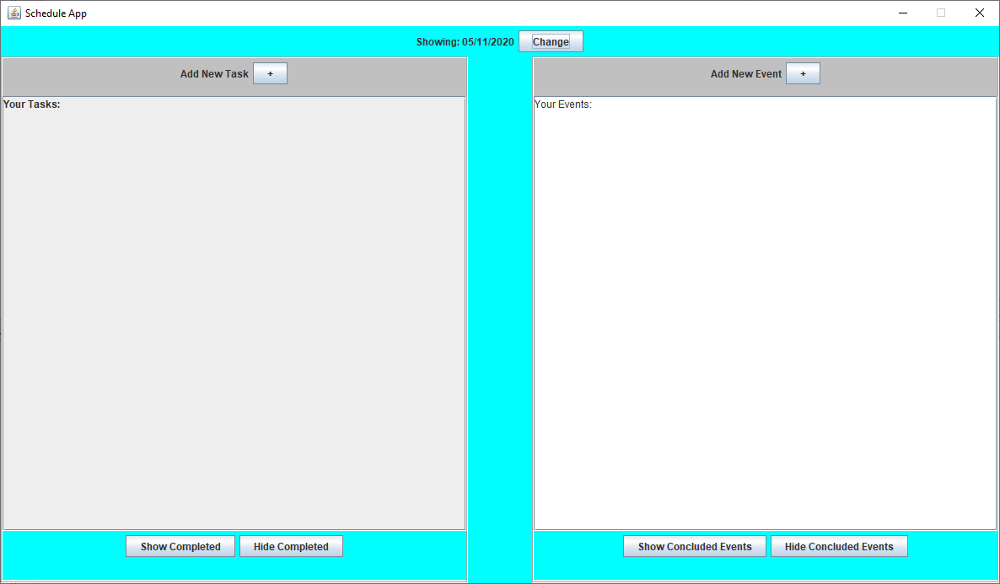
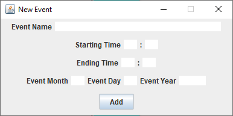
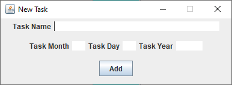
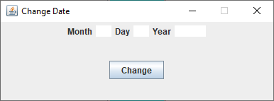

# IST 261: Scheduling Application
Scheduling application for daily tasks and events built in Java Swing.

## Table of Contents
1. [Installation](#Installation)
2. [File-Structure](#File-Structure)
3. [Features](#Features)
4. [Project-Showcase](#Project-Showcase)


### Compatibility
**Requirements**
* *JDK 8*


### **Installation**
Clone the repository.
```bash
$ git clone https://github.com/connellboyce/ScheduleApplication.git
```
Open the application in your IDE and run.


### **File-Structure**

```
ScheduleApplication
│   README.md
│   events.txt
│   tasks.txt
│   .gitignore
│
└── img/project-snapshots
│   └── *.png
│
└── src/scheduleapp
│   │   ScheduleApp.java
│   │   ScheduleAppController.java
│   │   ScheduleAppView.java
│   │   ScheduleAppModel.java
│   │   EventList.java
│   │   TaskList.java
│   │   Event.java
│   └── Task.java
└────────────────────────────────
```


### **Features**

* GUI Interface
* Create new Task
* Create new Event
* Toggle between showing and hiding completed tasks
* Toggle between showing and hiding concluded events
* Change the current display date
* Cross Platform
    * Mac, Windows, Linux


### **Project-Showcase**

**Main Page**



**Create a New Event**



**Create a New Task**



**Change the Display Date**



